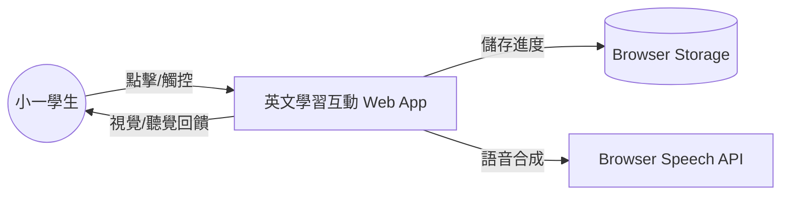

# 規格文件 (Specification)

## 1. 架構與選型
- **類型**: Single Page Application (SPA) embedded in a single HTML file.
- **技術棧**:
  - **HTML5**: 結構。
  - **CSS**: Tailwind CSS (透過 CDN 引入) 用於 UI 樣式 (清新美肌風格)。
  - **JavaScript**: 原生 ES6+ 用於邏輯控制。
  - **Audio**: Web Audio API 用於生成音效 (無需外部音檔)。
  - **Speech**: Web Speech API (SpeechSynthesis) 用於單字發音。
  - **Storage**: `localStorage` 用於儲存貼紙收集進度。
- **部署**: 單一 `index.html` 檔案，可直接於瀏覽器開啟。

## 2. 資料模型 (Data Model)
由於是單機網頁，資料將內嵌於 JavaScript 中。

### 2.1 單字資料 (Word Data)
源自 `words.csv`，轉換為 JSON 陣列：
```javascript
const wordsData = [
  { category: "Animals", word: "bird", emoji: "🐦" },
  { category: "Animals", word: "dog", emoji: "🐶" },
  // ... 更多單字 (將自動映射合適的 Emoji 或使用通用圖示)
];
```

### 2.2 使用者進度 (User Progress)
儲存於 LocalStorage 的 `english_learning_app_progress`：
```javascript
{
  "stickers": ["level1_clear", "level2_clear", ...] // 已獲得的貼紙/成就
}
```

## 3. 關鍵流程 (Key Processes)

### 3.1 應用程式初始化
1. 載入 `wordsData`。
2. 讀取 `localStorage` 獲取進度。
3. 渲染「遊戲大廳」(Lobby)。
4. 播放背景輕音樂 (可選，或是僅在互動時觸發音效)。

### 3.2 進入關卡
1. 使用者在遊戲大廳點擊關卡傳送門 (例如：聽音辨識、拼字遊戲)。
2. 系統切換 View 至對應遊戲畫面。
3. 隨機從 `wordsData` 抽取題目。

### 3.3 遊戲互動 - 聽音辨識 (Listening Game)
1. 系統播放單字讀音 (`SpeechSynthesis`).
2. 畫面顯示 3-4 個選項 (圖片/文字卡片)。
3. 使用者點擊選項。
   - **答對**: 播放成功音效 -> 顯示鼓勵動畫 -> 下一題。
   - **答錯**: 播放失敗音效 -> 提示正確答案 -> 允許重試。

### 3.4 遊戲互動 - 拼字遊戲 (Spelling Game)
1. 畫面顯示目標單字的圖片/Emoji。
2. 畫面打亂顯示該單字的字母。
3. 使用者拖曳或點擊字母依序填入空格。
4. 檢查拼寫是否正確。

### 3.5 結算與獎勵
1. 完成指定題數 (例如 5 題) 後結算。
2. 若全對或達到標準，解鎖對應「貼紙」。
3. 更新 `localStorage`。
4. 顯示收集冊按鈕，讓使用者查看成果。
5. 返回大廳。

## 4. 虛擬碼 (Pseudo-code)

```javascript
class App {
  constructor() {
    this.db = new DataManager();
    this.audio = new AudioManager();
    this.ui = new UIManager();
    this.state = 'LOBBY';
  }

  init() {
    this.db.loadWords();
    this.ui.renderLobby();
  }

  startGame(gameType) {
    this.state = 'GAME';
    const questions = this.db.generateQuestions(gameType);
    this.ui.renderGame(gameType, questions);
  }

  handleAnswer(isCorrect) {
    if (isCorrect) {
      this.audio.play('success');
      this.ui.showFeedback(true);
      // Check if level complete
    } else {
      this.audio.play('error');
      this.ui.showFeedback(false);
    }
  }
}
```

## 5. 系統脈絡圖 (System Context)


## 6. 模組關係圖 (Module Relationship)
- **DataManager**: 處理單字資料、進度讀寫。
- **AudioManager**: 封裝 Web Audio API (音效) 與 Speech API (發音)。
- **UIManager**: 處理 DOM 操作、Tailwind class 切換、視圖路由 (Lobby/Game/Reward)。
- **GameEngine**: 處理遊戲邏輯 (題目生成、計分、狀態判斷)。

## 7. 介面設計 (UI Design - "Fresh Beauty Style")
- **配色**: 天空藍 (#E0F2FE), 嫩綠 (#DCFCE7), 奶油黃 (#FEF3C7)。
- **元件**: 大圓角 (rounded-3xl), 陰影 (shadow-lg), 柔和漸層。
- **字體**: 圓體或無襯線體 (Sans-serif)，大字號適合兒童。

## 8. 測試計劃 (Testing Plan)
- **單元測試**: 測試資料載入是否正確、音效是否能觸發 (Mock AudioContext)。
- **功能測試**: 
  - 進入各個關卡。
  - 答對/答錯的流程。
  - 收集冊是否正確解鎖。
- **相容性**: 確認在 Chrome/Edge 上 Speech API 運作正常。
